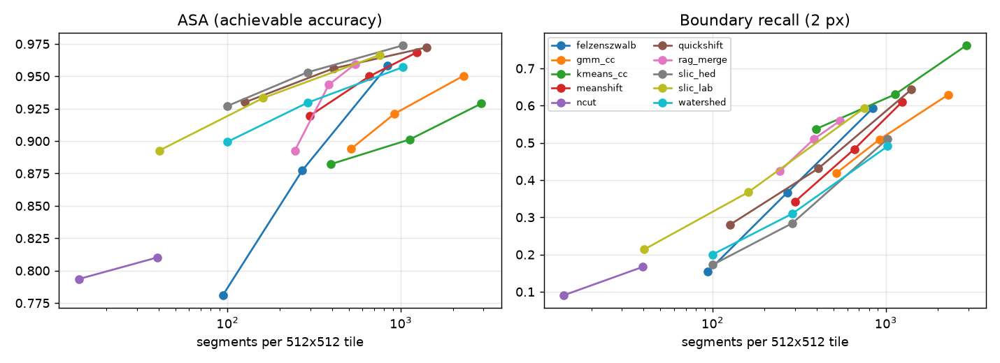
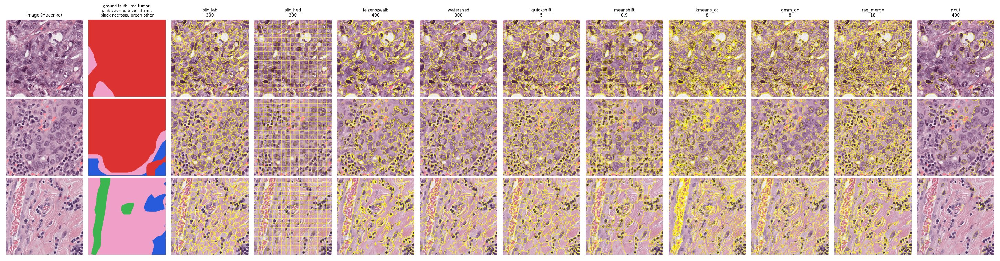

# BCSS Benchmark

Experiments using the BCSS breast cancer semantic segmentation dataset.

## Goal

Use BCSS to test a baseline tissue segmentation model and investigate how large tissue segmentation outputs can be reduced into a smaller representation for the WCSP solver.

## What to Do

1. **Download the BCSS dataset**
   - Use the Kaggle benchmark link (provided by professor).
   - Check the image and segmentation-mask format.

2. **Understand the labels**
   BCSS contains tissue-level annotations such as:
   - Tumor
   - Stroma
   - Inflammatory tissue
   - Necrosis
   - Other tissue

3. **Run a baseline**
   - Start with a **U-Net-style segmentation model**.
   - A pretrained BCSS model can be used if available.
   - The original FCN-based BCSS baseline can also be considered for comparison.

4. **Record the results**
   Save basic metrics such as:
   - Precision
   - Recall
   - F1 score / Dice score
   - IoU
   - Approximate runtime

5. **Inspect the predictions**
   Look at several examples and check:
   - Are tumor and stroma regions separated correctly?
   - Are inflammatory and necrotic regions detected?
   - Which tissue classes are most commonly confused?

6. **Document important decisions**
   Record:
   - Baseline model used
   - Dataset split
   - Pretrained checkpoint or training setup
   - Important preprocessing
   - Metrics
   - Any issues encountered

## Connection to WCSP

BCSS produces tissue-level segmentation rather than individual cell predictions.

Before using the output in the WCSP, the segmentation must be compressed into a smaller number of regions or clusters.

Compare clustering approaches such as:

- K-means
- DBSCAN
- Spatially constrained agglomerative clustering

The main goal is to reduce the number of WCSP variables while preserving useful spatial and biological information.

---

## Clustering and feature experiments

All runs use BCSS_512 with the 5 coarse classes (tumor, stroma, inflammatory, necrosis, other). Train = 106 ROIs; 14 of them (693 tiles) are held out as a dev split for model selection; val = 2,768 tiles from 45 ROIs at hospitals never seen in train. Don't-care pixels are never scored. Code is in [`scripts/`](scripts/); large outputs (caches, features) go to the git-ignored `data/` directory.

| Track | Script | Status |
| --- | --- | --- |
| Superpixel / clustering benchmark | `cluster_classical.py --part 1` | done, below |
| Phikon-v2 patch features: clustering, codebook, linear probe | `dino_features.py --model phikon2` | done, below |
| Unsupervised pixel classification (k-means / GMM on stain colour) | `cluster_classical.py --part 2` | handed off: [HANDOFF_unsupervised_pixel_classification.md](HANDOFF_unsupervised_pixel_classification.md) |
| DINOv2 (natural-image) features, U-Net baseline | `dino_features.py --model dinov2`, `train_unet.py` | deferred; DINOv2 features already extracted |

### 1. Over-segmentation benchmark

**Question:** which unsupervised method splits a tile into regions that a WCSP could label well, with as few regions (WCSP variables) as possible?

**Setup:** 60 val tiles at native 512 px, picked round-robin across ROIs (at least 50% labeled), Macenko stain-normalized. Each method is swept over its size parameter. Scores per tile, then averaged:

- **ASA** (achievable segmentation accuracy): pixel accuracy if every segment gets its majority true class. An upper bound for any labeling of those segments, e.g. by a WCSP.
- **Oracle mIoU:** mIoU of that same best labeling. More telling than ASA, because most tiles are dominated by one class (normalized cut with only 14 segments per tile already scores ASA 0.79).
- **Boundary recall:** share of true class-boundary pixels within 2 px of a segment boundary.

Methods at a comparable size (≈ 100–550 segments per tile; full sweep in [`results/clustering_superpixels.csv`](results/clustering_superpixels.csv)):

| Method | Setting | Segments / tile | ASA | Oracle mIoU | Boundary recall | s / tile |
| --- | --- | ---: | ---: | ---: | ---: | ---: |
| Phikon-v2 tokens, per-tile k-means | k = 16 | 79 | 0.918 | 0.787 | 0.34 | 0.1 + features |
| Quickshift | kernel 5 | 408 | 0.956 | 0.882 | 0.43 | 5.5 |
| SLIC on HED | 300 | 289 | 0.953 | 0.876 | 0.28 | 0.4 |
| RAG greedy merge (from SLIC 1000) | threshold 18 | 384 | 0.943 | 0.834 | 0.51 | 2.4 |
| Compact watershed | 300 markers | 289 | 0.930 | 0.813 | 0.31 | 0.4 |
| SLIC on Lab | 300 | 161 | 0.933 | 0.811 | 0.37 | 0.5 |
| Mean shift (64 px thumbnail) | bandwidth 1.2 | 299 | 0.920 | 0.794 | 0.34 | 6.0 |
| Felzenszwalb | scale 400 | 270 | 0.877 | 0.748 | 0.37 | 0.8 |
| GMM pixel clusters + components | k = 5 | 518 | 0.894 | 0.745 | 0.42 | 0.4 |
| k-means pixel clusters + components | k = 5 | 395 | 0.882 | 0.723 | 0.54 | 0.3 |
| Normalized cut (from SLIC 400) | default | 40 | 0.810 | 0.574 | 0.17 | 5.8 |





Findings:

- **Phikon-v2 features give the most labelable regions per variable.** Per-tile k-means on its patch tokens reaches 0.787 oracle mIoU with 79 segments; colour methods need 250–400 segments to match it. Its boundaries are blocky (32 px cells), so it pairs naturally with the boundary-refinement WCSP (formulation C in the [design doc](../../docs/design/segmentation-wcsp-pipeline.md)).
- **Among colour methods, quickshift and RAG merging are best at ≈ 400 segments; SLIC on Lab is the best speed/quality trade-off** (0.5 s/tile, 0.905 oracle mIoU at 750 segments).
- **SLIC on HED is effectively a regular grid** (see the example figure): its compactness (0.1) is too high for features scaled to 0–1. Its high scores show that small regular tiles do well on these coarse polygon masks, not that it follows tissue edges.
- **Pixel clustering has the highest boundary recall but the lowest ASA:** its segments trace nuclei and colour edges, which are not tissue-class boundaries.
- **Normalized cut is too coarse and unstable** here: few segments, and ARPACK failed to converge on 1 of 60 tiles (recorded in the CSV's `failed_tiles`).
- Boundary recall stays at or below 0.54 at these sizes, partly because the ground truth is hand-drawn polygons, whose edges rarely sit on an image edge.

### 2. Phikon-v2 features: classification

**Question:** how much tissue-class information do frozen pathology foundation-model features carry, with no or minimal supervision?

**Setup:** [Phikon-v2](https://huggingface.co/owkin/phikon-v2) (ViT-L/16, trained with the DINOv2 recipe on pathology tiles) is used frozen. Each 512 px tile is resized to 256 px, giving a 16 × 16 grid of 1024-dim patch tokens (one per 32 × 32 px of the original tile). Features were extracted for 2,000 random train tiles outside the dev ROIs, the 693 dev tiles and all val tiles (about 2.3 tiles/s on an M2 GPU). Cell predictions are upsampled and scored against 256 px val masks.

| Method | Labels used | Val mIoU | Pixel acc | Tumor | Stroma | Inflam. | Necrosis | Other |
| --- | --- | ---: | ---: | ---: | ---: | ---: | ---: | ---: |
| Codebook: global k-means, k = 5, clusters named by majority train label | naming only | 0.267 | 0.698 | 0.769 | 0.568 | 0.000 | 0.000 | 0.000 |
| Codebook, k = 10 | naming only | 0.495 | 0.770 | 0.769 | 0.616 | 0.438 | 0.653 | 0.000 |
| Codebook, k = 20 | naming only | 0.545 | 0.756 | 0.734 | 0.589 | 0.458 | 0.548 | 0.397 |
| Codebook, k = 50 | naming only | 0.561 | 0.775 | 0.751 | 0.631 | 0.401 | 0.588 | 0.435 |
| Linear probe (logistic regression on tokens, weight decay picked on dev) | train fit tiles | **0.652** | **0.836** | 0.814 | 0.705 | 0.618 | 0.691 | 0.430 |

Per-class columns are IoU. Full rows (with Dice) are in [`results/dino_classification.csv`](results/dino_classification.csv); the probe's confusion matrix is in [`results/dino_probe_confusion.json`](results/dino_probe_confusion.json).

Findings:

- **Unsupervised clusters of Phikon-v2 features already separate tissue types:** with 50 clusters and labels used only to name them, val mIoU is 0.56. With k = 5 the rare classes get no cluster at all (IoU 0), the same failure the handoff warns about for colour clustering.
- **A linear probe reaches 0.65 mIoU** on hospitals never seen in training. It is a cheap supervised baseline and a source of calibrated class probabilities for WCSP unary costs (saved as `data/outputs/dino/phikon2_probe_val_probs16.npz`, 16 × 16 cells per tile).
- **Main confusion:** stroma predicted as inflammatory (10% of stroma pixels) and tumor predicted as stroma (7% of tumor pixels). "Other" is weakest (IoU 0.43); it is a mix of 12 rare BCSS codes.
- For context, an early partial run with natural-image DINOv2 features gave codebook mIoU of only 0.16–0.17, which suggests pathology pretraining matters; that comparison is deferred.

### How to reproduce

```bash
.venv/bin/pip install -r requirements.txt scikit-image scikit-learn scipy pandas matplotlib igraph leidenalg transformers
.venv/bin/python benchmarks/bcss/scripts/cluster_classical.py --part 1 --tiles 60 --workers 3   # ~30–40 min
.venv/bin/python benchmarks/bcss/scripts/dino_features.py extract --model phikon2                # ~40 min, GPU/MPS
.venv/bin/python benchmarks/bcss/scripts/dino_features.py evaluate --model phikon2               # ~15 min
```

Every step caches its progress under `data/outputs/` and resumes if interrupted. Run heavy steps one at a time on a 16 GB machine.
